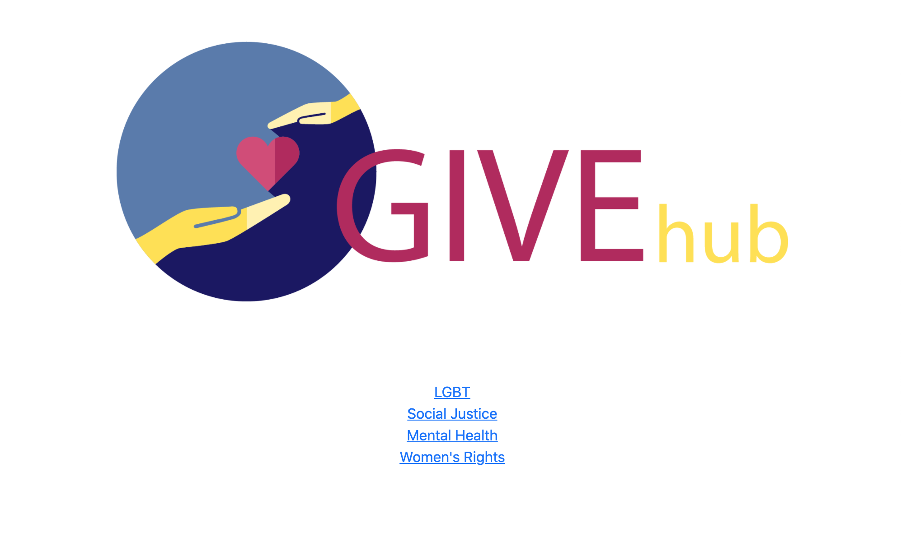
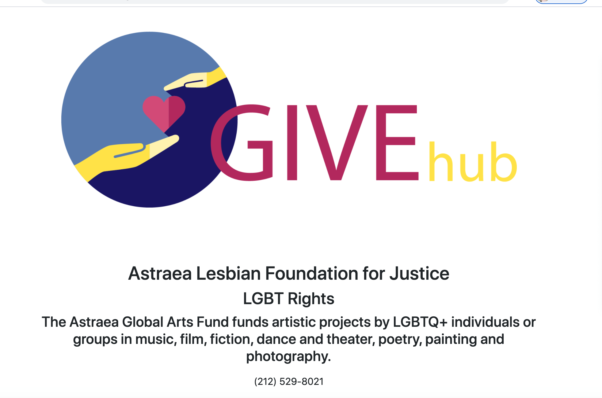

# GIVEHUB

## Description 
Using everything we have learned over the past six units we will be creating a full-stack application. Working with our group our task is to create an application that comibines back end--with servers, databases, advanced APIs, and user authentication—-to the front end. The front end will also be built from scratch.

## User Story
As a user I’m looking to find charities that align with causes I am passionate about. I want to be able to make a profile and save the types of causes that I want to know more about. Once I choose a cause, a list of up to 10 verified charities will populate on the page. I will then be able to set a minimum or maximum based on how much I’m able to donate. After submitting I will be able to click on a specific charity, which then will provide all necessary information with a direct link to donate. Lastly I will be able to log out of my profile and when I log back in at a different time, my preferences will remain intact.

## Directions 
For our app the first thing to do is run our seeds file with the database we created
Then run the server.js file to spin up our server
We can then go to our localhost:3001 and user will be prompted to log in or sign up
After that user will be presented with types of charities to choose from
Once they choose a list of charities will appear individually with their info

## Acceptance Criteria 
Given when Node.js and Express.js is used to create a RESTful API.
Application uses Handlebars.js as the template engine.
Also MySQL and the Sequelize ORM is used for the database.
Given when app has both GET and POST routes for retrieving and adding new data.
Given when one new library, package, or technology that we haven’t discussed is included.
App should have a folder structure that meets the MVC paradigm.
Given when app includes authentication (express-session and cookies).
Also must protect API keys and sensitive information with environment variables.
Given when app is deployed using Heroku (with data).
Application should have a polished UI, be responsive, and be interactive (i.e., accept and respond to user input).
Given when project meets good-quality coding standards (file structure, naming conventions, follows best practices for class/id naming conventions, indentation, quality comments).
Project should include a professional README (with unique name, description, technologies used, screenshot, and link to deployed application).

## Mock-Up
()

()

The link to our repo is:
https://github.com/agonzalvez/givehub

The link go our app on heroku is:
https://upper-beaver-88035.herokuapp.com/

## Collaborators 
Alys Dickerson
Alejandro Gonzalvez
Lougine Scott
Nancy Gonzalez